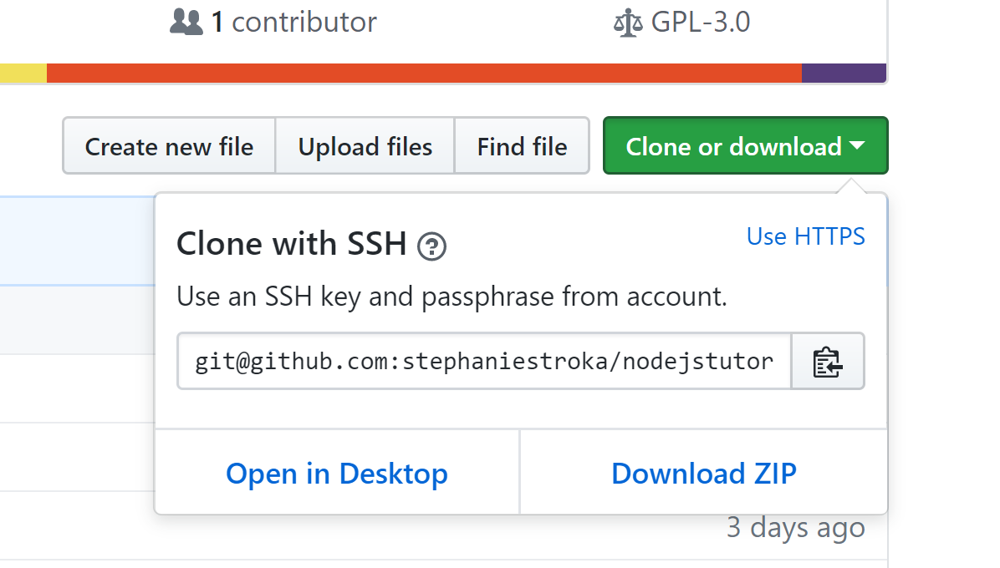
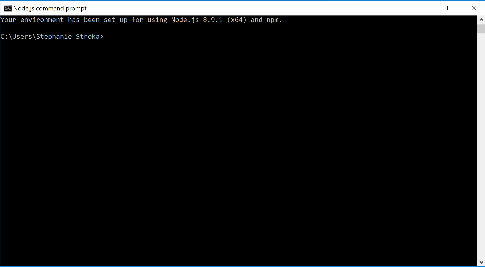
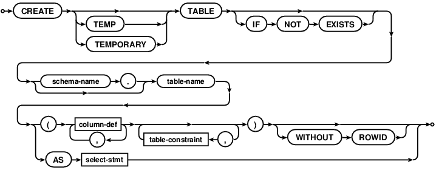
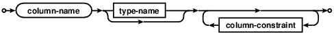
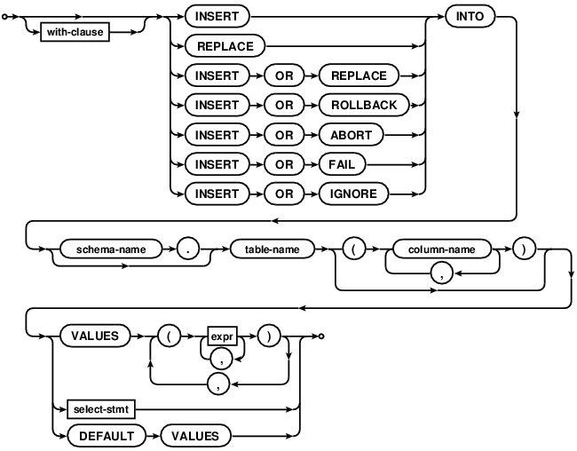
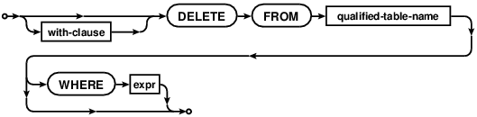
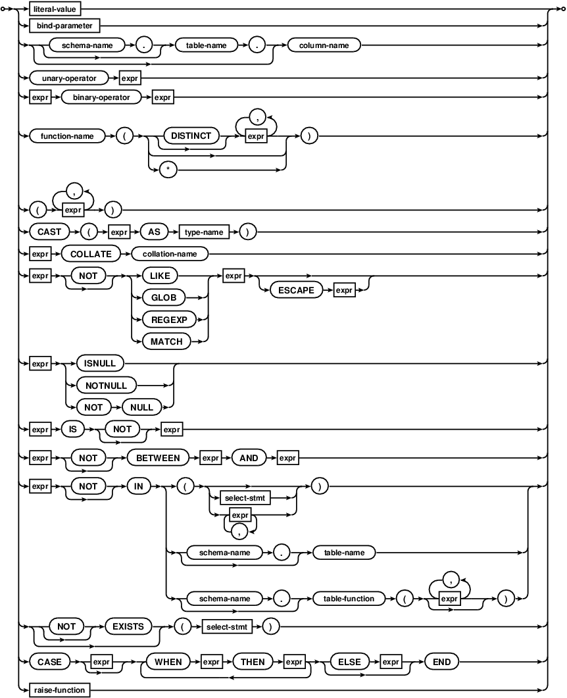
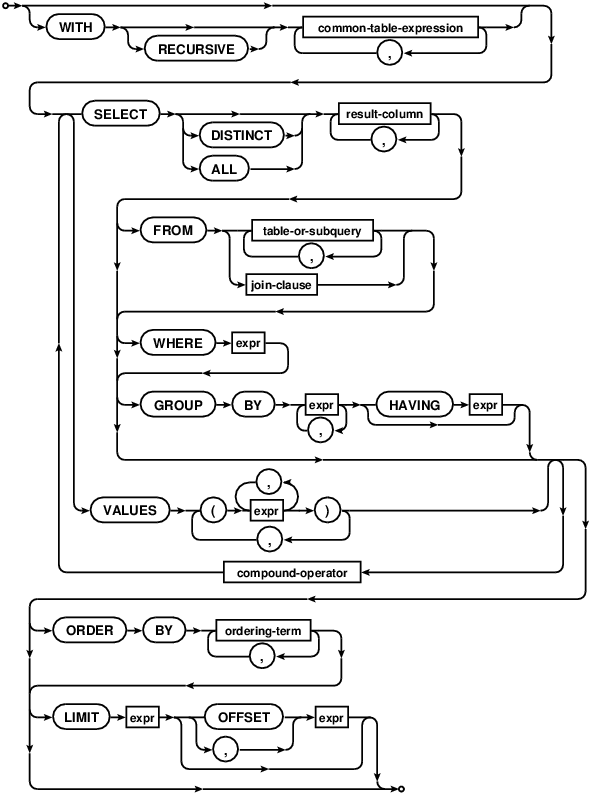

## Introduction to **Node.js** for server-side scripting

#### by Stephanie Stroka and Kaspar Etter
on 18 and 19 November 2017

### Preparations

#### Step 1

Download node js here: [https://nodejs.org/en/](https://nodejs.org/en/). Please choose the LTS version!

#### Step 2

Download the example from here: [https://github.com/stephaniestroka/nodejstutorial](https://github.com/stephaniestroka/nodejstutorial) by clicking on "Clone or download" -> "Download ZIP".



#### After you have downloaded the zipfile, please extract it in a suited directory, e.g.

on Windows:

C:\Users\Stephanie Stroka\Documents\Studienstiftung\Programming Seminar 2017\

on MacOS:

/Users/KasparEtter/Documents/Studienstiftung/Programming Seminar 2017/

#### Step 3

If you are on Windows, open the *node.js command prompt* (see screenshot below) or another terminal, e.g. *PowerShell*.



If you are on MacOS or Linux, open the terminal.

#### Step 4

Switch into the directory by using the command "cd", e.g.

On Windows:

cd 'C:\Users\Stephanie Stroka\Documents\Studienstiftung\Programming Seminar 2017\nodejstutorial'

On MacOS/Linux:

cd /Users/KasparEtter/Documents/Studienstiftung/Programming Seminar 2017/nodejstutorial

#### Step 5

Download required NPM modules.

```
npm install express --save
npm install body-parser --save
npm install sqlite3 --save
```

Note: We experienced problems with people that had nodejs in version 9.2.0. Please make sure that it is 8.9.1. To do so, you can use the command "node -v" on the command line/terminal. -v stands for version.

### A first example

Let's take one step back before looking at the example that we just downloaded. To understand how an HTTP request is accepted and executed on the server side, we are going to create a new server JavaScript file called "*firstexample.js*", which accepts a network request and respond with a simple "Hello World!".

#### Step 1

Create a file called firstexample.js.

#### Step 2

Copy the following code:

```
const express = require('express');

const app = express();

app.get('/', function (req, res) {
    res.send("Hello World!");
})

app.listen(8080, () => console.log('App listening on port 8080!'))
```


In this example, we use the express module to accept requests on port 8080 with HTTP method GET on the default path /.

#### Step 3

Now go back to the NodeJS command prompt or terminal and start the node server by typing:

```
node server.js
```

#### Step 4

Visit [http://localhost:8080/](http://localhost:8080/) and observe what happens.

Congratulations, you build your first webserver that accepts requests on path / and responds with "Hello world".

#### Code details

The require function loads an external module. In this case, the module *express *is loaded, which handles incoming HTTP requests and outgoing HTTP responses.

const express and const app are two variable declarations for variables that are read-only. So it is not possible to override them after they are assigned.

express() creates a new object and initializes the webserver. The webserver object is stored in the variable app.

With app.get() we declare that the webserver should handle incoming requests on path / with the function that is given as a second argument.

With app.listen() we say that the webserver should listen on port 8080 for incoming network requests.

### Serving static files example

In this next example, we are going to serve static files from the "public" directory. Static files are files that do not have to be dynamically generated on the server side. In our case, that's the index.html, main.css, index.js and the image mickey.png. All those files can be found in the nodejstutorial base directory under the public directory.

#### Step 1

Change the code as follows:

```
const express = require('express');

const app = express();

app.use(express.static('public'));

app.listen(8080, () => console.log('App listening on port 8080!'))
```


#### Code details

As you can observe, we removed the get function that serves requests for / and instead called the function "use()" with the argument express.static(), which itself takes the directory in which our public files are as an argument.

### Define APIs (Application Programming Interface)

Sometimes we want to generate data dynamically instead of serving static data from the public directory. In our example, we eventually want to be able to accept requests on the path /api/messages for adding new messages and receiving a list of existing messages,

We can observe this in the existing server.js from the downloaded example.

(Only code snippets are shown from know on. Please have a look at server.js for the complete file)

```
// Defines a new API at the URL path /api/messages with method GET.
// If called, all messages are returned to the client.
app.get('/api/messages', function (req, res) {
    // Retrieve all stored messages
});

// Instructs the app to parse a URL-encoded POST request body.
app.use(bodyParser.urlencoded());

// Defines a new API at the URL path /api/messages with method POST.
// If called, a name-message object is read from the request body and
// passed to the addMessage() function.
app.post("/api/messages", function (req, res) {
    // Store a new message
});
```


In the above example, we declare two API methods on path /api/messages: The first one listens for incoming GET requests and the second one for incoming POST requests. Before the second one, we also need to give a hint about how the request body is supposed to be parsed (in our case, it is URL encoded).

### Implement the APIs

We now want to add some functionality to the APIs.

#### Step 1

First of all, to keep the code clean and maintainable, we want to create a new module. This helps us to keep logically coherent code together.

To do so, we can observe that we have a messages.js file in the api directory.

This messages.js file contains our messages module. It contains two methods that are accessible from outside, namely addMessage() and getMessages():

```
exports.addMessage = function(message) {
}

exports.getMessages = function(onresult) {
};
```


To make those methods available to the outside, they need to be prefixed with "exports." (in other, more correct terms, they are added to the exports object, which is available in the NodeJS  development environment).

Now we can go back to the server.js and observe that the messages module is imported using "require()":

```
// Includes our own 'messages' module, which you can find in in the base directory under 'api/messages.js'.
const messages = require('./api/messages');
```


We can also observe the content of the API definitions from the previous section:

```
// Defines a new API at the URL path /api/messages with method GET.
// If called, all messages are returned to the client.
app.get('/api/messages', function (req, res) {
    messages.getMessages(function (rows) {
        res.send(rows);
    });
});

// Instructs the app to parse a URL-encoded POST request body.
app.use(bodyParser.urlencoded());

// Defines a new API at the URL path /api/messages with method POST.
// If called, a name-message object is read from the request body and passed to the addMessage() function.
app.post("/api/messages", function (req, res) {
    messages.addMessage(req.body);
    res.sendStatus(200);
});
```


In the GET /api/messages implementation, we call getMessages() and in the POST /api/messages implementation we call addMessage() with the request body which should be correctly parsed thanks to the bodyParser.urlEncoded().

To understand the details of the addMessage() and getMessages() functions, we first give an overview of SQL in the next section.

## Introduction to **SQL** for the persistence of data

SQL stands for [Structured Query Language](https://en.wikipedia.org/wiki/SQL) and consists of a [data definition language](https://en.wikipedia.org/wiki/Data_definition_language), [data manipulation language](https://en.wikipedia.org/wiki/Data_manipulation_language), and [data control language](https://en.wikipedia.org/wiki/Data_control_language). Its purpose is to store and retrieve data to and from a [relational database](https://en.wikipedia.org/wiki/Relational_database_management_system). Such a database keeps all its data in tables (similar to an Excel sheet). There are many relational databases and the most-popular open-source databases are SQLite, MySQL/MariaDB, and PostgreSQL. Unfortunately, each of them understands a slightly different dialect of SQL. In the following, we’ll see how to create a table, how to insert and delete a row, and how to query a table with SQLite. The full syntax can be found at [https://www.sqlite.org/lang.html](https://www.sqlite.org/lang.html).

##### How to Install

[https://www.sqlite.org/download.html](https://www.sqlite.org/download.html)

##### Creating a Table

Documentation: [https://www.sqlite.org/lang_createtable.html](https://www.sqlite.org/lang_createtable.html)

create-table-stmt:



column-def:



Example: CREATE TABLE IF NOT EXISTS comments (key INTEGER PRIMARY KEY, time INTEGER NOT NULL DEFAULT CURRENT_TIMESTAMP, value TEXT NOT NULL);

##### Inserting a Row

Documentation: [https://www.sqlite.org/lang_insert.html](https://www.sqlite.org/lang_insert.html)

insert-stmt:

Example: INSERT INTO comments (value) VALUES ("hello world");

##### Deleting a Row

Documentation: [https://www.sqlite.org/lang_delete.html](https://www.sqlite.org/lang_delete.html)

delete-stmt:



expr:



Example: DELETE FROM comments WHERE key = 1;

##### Querying a Table

Documentation: [https://www.sqlite.org/lang_select.html](https://www.sqlite.org/lang_select.html)

select-stmt:



Example:
```
SELECT * FROM comments WHERE value LIKE "%world%" ORDER BY time ASC;
```
